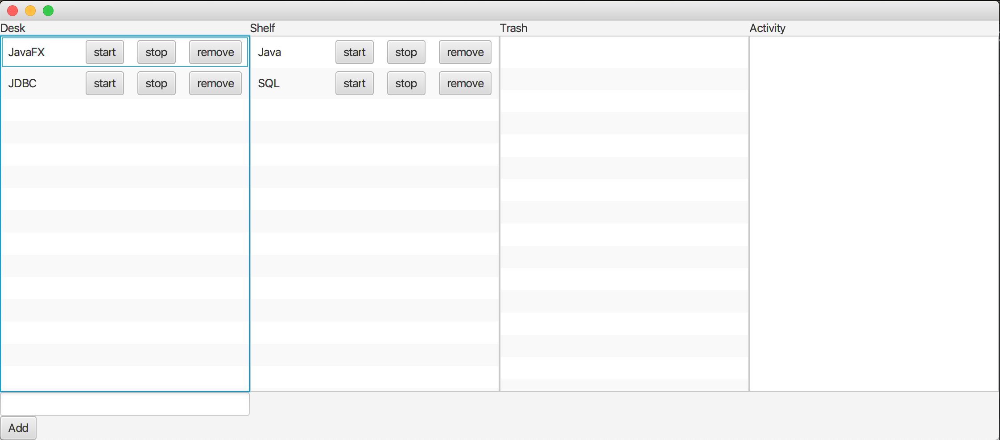

# 4wards POC1.a
A test I created to explore concepts for the . It also served as an exploration of screen navigation in JavaFX and the Date/Time API. 

It simply allows you to add a topic to your "Desk", and hit start, making a timer start counting. Upon hitting the stop button, it concludes a session and displays it in the Activity pane. The Desk pane, Shelf pane, and Trash pane are backed up in text files, and they support drag and drop sorting and transferring. 
